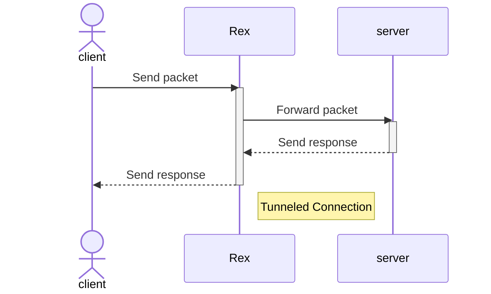

# Absolutus Rex

**absolutus_rex** is a CLI tool to forward ports. The name means "Absolute King" in Latin. It is currently on version 0.2.0.

## Usage

To use **absolutus_rex**, run the following command:

```bash
absolutus_rex [OPTIONS] --r-address <REMOTE_ADDRESS> --r-port <REMOTE_PORT>
```



### Options

- `-p, --ports <PORTS>`: Local port - requires a local port that are available for use
- `-l, --local-only`: This flag only opens a port on the local network (127.0.0.1), and is intended for debugging purposes
- `-a, --r-address <REMOTE_ADDRESS>`: This flag sets the remote address
- `--r-port <REMOTE_PORT>`: This flag sets the remote port
- `-h, --help`: Print help (see more with '--help')
- `-V, --version`: Print version

Note: The `--r-address`, `--r-port` and `--ports` options are required.

## Installation

To install **absolutus_rex**, follow these steps:

1. Download the latest release from the [releases page](https://github.com/fmotalleb/absolutus_rex/releases).
2. Extract the contents of the ZIP file.
3. Navigate to the extracted directory.
4. Run the `absolutus_rex` file with `--help` flag to see instructions.

## License

This project is licensed under the MIT License - see the [LICENSE](LICENSE) file for details.

## TODO

- [ ] config file
- [ ] deamonize (after config file)
- [ ] dns server
- [ ] ipv6 support
- [ ] multiple remote server
